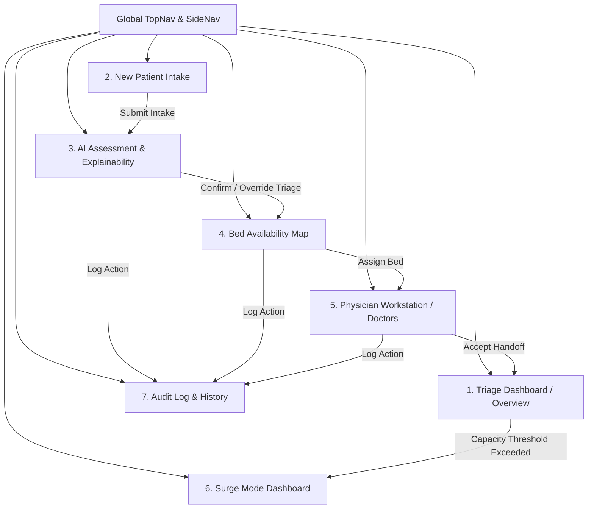
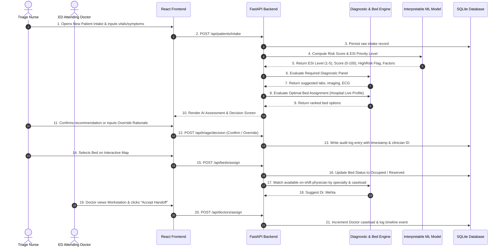
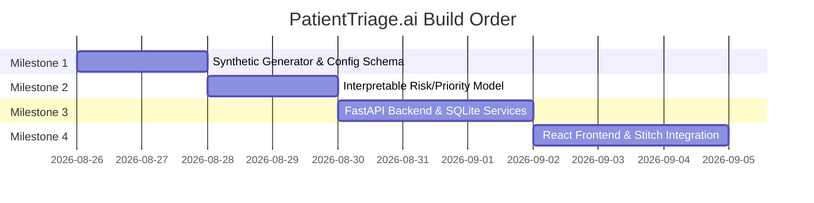

# PatientTriage.ai — Design & System Specification

## 1. Application Purpose & Clinical Context

**PatientTriage.ai** is an intelligent, clinician-in-the-loop hospital emergency department (ED) triage, risk prediction, and bed/staff assignment platform. It is engineered for high-acuity medical environments where cognitive load must be minimized to support rapid, error-free clinical decision-making.

### Core Objectives
1. **Accelerate Patient Intake & Triage:** Structured capture of chief complaints, vital signs, physical distress observations, and medical history.
2. **Transparent AI Risk Scoring (Prototype / Synthetic Target):** Fast, explainable priority/risk assessment (ESI Levels 1–5 + Risk Score + High-Risk Alert) with local feature contribution explanations (e.g., "SpO2 < 90%", "HR > 120 bpm").
   > **Clinical Disclaimer:** Triage levels, risk scores, and recommendations produced by this prototype system are derived from synthetic data for demonstration, architecture, and prototype validation purposes only. They are NOT clinically validated or certified for actual medical diagnosis or live clinical decision-making.
3. **Dynamic Hospital Live Capacity & Bed Matching:** Real-time awareness of waiting room crowding, total/available/occupied beds by unit and individual bed status, equipment capabilities per bed, and swappable hospital profile configurations.
4. **Physician Caseload Balancing & Smart Check-In:** Active physician shift tracking, specialty matching, and real-time handoff queue management.
5. **Rule-Based Diagnostic Protocol Engine:** Instant diagnostic panel suggestions (Labs, Imaging, ECG, Point-of-Care) based on transparent clinical lookup tables.
6. **Future / Optional Capabilities:** Surge Mode crisis console and Audit Log timeline are designed as extensible future enhancements.

---

## 2. Design System: Clinical Precision System

Derived from the Stitch project: **"Remix of PatientTriage.ai Healthcare Platform"**

### 2.1 Design Philosophy & Visual Aesthetic
- **Personality:** Authoritative, calm, utilitarian, and high-density.
- **Aesthetic:** Modern Clinical / Corporate with high-contrast typography, strict 4px grid rhythm, and low-contrast structural borders instead of muddy decorative shadows.
- **Visual Scannability:** 4px vertical severity strips on cards/rows, high-contrast severity badges, and structured bento-grid metric containers.

### 2.2 Color Palette & Design Tokens

| Token Name | Hex Code | Role / Usage |
| :--- | :--- | :--- |
| `primary` | `#003C90` | Primary brand accent, active borders |
| `primary-container` | `#0F52BA` | Clinical Blue — primary buttons, prominent headers, hero icons |
| `on-primary` | `#FFFFFF` | Text/icons on primary surfaces |
| `on-primary-container` | `#BCCEFF` | Light blue text/accents on dark blue containers |
| `secondary` | `#5B5E6B` / `#00696B` | Supporting elements, subtle icons, secondary buttons |
| `background` | `#F8F9FA` | Low-glare off-white application background |
| `surface` | `#FFFFFF` | Card backgrounds, table bodies, navigation pane |
| `surface-bright` | `#FAF8FF` | Hover states on table rows and cards |
| `surface-container-low` | `#F3F3F6` | Tag backgrounds, input disabled fills, subtle headers |
| `surface-container` | `#EEEEF0` | Structural dividers and secondary cards |
| `surface-container-high` | `#E8E8EA` | Active tab highlights, badge containers |
| `outline-variant` (`border`) | `#E0E2E6` | Standard 1px card and table borders |
| `outline` | `#737784` | Neutral icons, placeholder text, inactive timeline pins |
| `text-primary` (`on-surface`) | `#1A1C1E` | Primary headings, table text, patient names |
| `text-secondary` (`on-surface-variant`)| `#44474E` | Subtitles, labels, metadata, timestamps |

#### 5-Level Triage Severity Scale (Emergency Severity Index / ESI)

| Severity Level | Acuity Name | Color Hex | Background Tint | Clinical Meaning | Target Wait Time |
| :--- | :--- | :--- | :--- | :--- | :--- |
| **Level 1** | Resuscitation | `#D32F2F` | `#FFEBEE` / `#FFDAD6` | Immediate life-threat; cardiac arrest, severe respiratory arrest | 0 min (Immediate) |
| **Level 2** | Emergent | `#F57C00` | `#FFF3E0` | High risk, confused/lethargic, severe pain, unstable vitals | < 10 min |
| **Level 3** | Urgent | `#FBC02D` | `#FFFDE7` / `#FFF3CD` | Stable vitals, requires multiple resources (labs + imaging + IV) | < 30 min |
| **Level 4** | Less Urgent | `#388E3C` | `#E8F5E9` | Stable, requires single resource (e.g., X-ray or simple sutures) | < 60 min |
| **Level 5** | Non-Urgent | `#78909C` | `#ECEFF1` | Stable, requires no resources (e.g., medication refill, rash) | < 120 min |

### 2.3 Typography (Typeface: Inter)

| Style Token | Size / Line Height | Weight | Letter Spacing | Clinical Usage |
| :--- | :--- | :--- | :--- | :--- |
| `display-lg` | 32px / 40px | Bold (700) | -0.02em | KPI Metric counts, Surge title |
| `headline-md` | 24px / 32px | SemiBold (600) | Normal | Page titles, major section headings |
| `headline-sm` | 20px / 28px | SemiBold (600) | Normal | Card group titles, modal headers |
| `card-title` | 16px / 24px | SemiBold (600) | Normal | Patient names, card headings, button labels |
| `body-lg` | 16px / 24px | Regular (400) | Normal | Diagnostic descriptions, clinical narratives |
| `body-md` | 14px / 20px | Regular (400) / Med (500) | Normal | Table text, form values, doctor notes |
| `label-md` | 12px / 16px | SemiBold (600) | +0.05em | Uppercase table headers, metadata tags |
| `label-sm` | 11px / 14px | Medium (500) | Normal | Timestamps, vital unit labels, footers |

### 2.4 Spacing, Layout & Elevation
- **Baseline Unit:** `4px`
- **Density Compact:** `8px` (used for data table cell padding, compact patient lists)
- **Density Comfortable:** `16px` (form padding, card spacing)
- **Gutter:** `16px` to `24px`
- **Margin Desktop:** `32px` | **Margin Mobile:** `16px`
- **Border Radii:** `sm: 2px`, `DEFAULT: 4px`, `lg: 8px`, `xl: 12px`, `full: 9999px`
- **Elevation:** Flat with `1px solid #E0E2E6` outlines. Active states use `2px solid #003C90`. Modals use a `10% black` backdrop scrim.

---

## 3. Screens & User Navigation Flow

The application structure consists of 7 primary screens accessible via a persistent Left Navigation Sidebar (`w-64`) and contextual Header (`h-16`).



### Screen 1: Triage Dashboard (`/` or `/dashboard`)
- **Purpose:** Primary command center for the Emergency Department charge nurse and triage team.
- **Key Sections:**
  - **Hospital Header:** Hospital name ("St. Mary's General"), Department switcher, Global Search, Notification bell, User avatar.
  - **Bento KPI Bar (5 Metrics):**
    - Patients Today (e.g., 142)
    - Waiting in Lobby (e.g., 27, Orange)
    - Critical L1/L2 (e.g., 4, Red pulse)
    - Beds Available (e.g., 11, Green)
    - Reassessments Due (e.g., 3, Yellow)
  - **Filter & Search Bar:** Filter by Severity (All, L1–L5), Age Group (Pediatric, Adult, Geriatric), Wait Time (>1h, >4h).
  - **Live Triage Table:** Columns for Severity Level Tag (L1–L5 with 4px left strip), Patient ID & Name/Age/Sex, Chief Complaint + Vital Signs Pill Grid (BP, HR, SpO2, Temp), AI Assessment & Confidence bar, Wait Duration, and Action ("Triage" / "Assign").

### Screen 2: New Patient Intake (`/intake`)
- **Purpose:** Rapid-entry structured intake form for newly arrived walk-in or EMS ambulance patients.
- **Key Sections:**
  - **Workflow Stepper:** Visual step progression (`Patient -> Symptoms -> Vitals -> History -> AI Assessment -> Review`).
  - **Patient Information Card:** Patient ID (auto-generated), Full Name, Date of Birth, Calculated Age, Biological Sex, Arrival Mode (Walk-in, Ambulance, Helicopter, Police), Known Allergies (tag input).
  - **Chief Complaint & Symptoms Card:** Free-text Chief Complaint (patient's words), Quick-Select Multi-Choice Symptom chips (Chest Pain, Shortness of Breath, Abdominal Pain, Fever, Nausea, Dizziness, Laceration, Neurological deficit), Clinician Observations checklist (Pale/Diaphoretic, Lethargic, Labored Breathing, Confused).
  - **Vital Signs Input Grid:** Heart Rate (HR), Blood Pressure (Systolic/Diastolic), Oxygen Saturation (SpO2), Respiratory Rate (RR), Body Temperature (°C), Glasgow Coma Scale (GCS).
  - **Medical History & Comorbidities:** Hypertension, Diabetes, COPD/Asthma, CAD/MI history, Immunocompromised, Previous Surgeries.
  - **Action Button:** "Run AI Triage Assessment" / "Save & Proceed".

### Screen 3: AI Assessment & Decision (`/assessment/:patientId`)
- **Purpose:** Clinician-in-the-loop review of the machine learning risk prediction, explainability factors, and decision recording.
- **Key Sections:**
  - **Patient Context Banner:** Patient ID, Intake timestamp, Current Status ("Pending Review").
  - **AI Recommendation Card:** Prominent acuity banner (e.g., `LEVEL 2 — EMERGENT`), Circular SVG Confidence Gauge (e.g., `87% Confidence`), High-Risk Alert badge.
  - **Explainability Panel ("Why this recommendation?"):** 4 structured factor cards breaking down the top contributors (e.g., "SpO2 below range: 88%", "Elevated HR: 124 bpm", "Low BP: 92/58 mmHg", "High-Risk Chief Complaint: Chest Pain").
  - **Uncertainty Alert:** Yellow alert box displayed if prediction entropy is high or boundary cases exist between adjacent levels.
  - **Clinician Decision Action Panel:**
    - Primary Action: `CONFIRM LEVEL 2` (one-click approval).
    - Secondary Action: `OVERRIDE RECOMMENDATION` (expands override form).
    - Override Drawer/Modal: Dropdown for new Level (L1–L5), Required Clinical Rationale text field, Confirm Override button.
  - **Suggested Required Tests:** Diagnostic panel suggestions (e.g., 12-Lead ECG, Troponin I, CBC, CMP, Portable CXR).

### Screen 4: Bed Availability & Department Map (`/beds`)
- **Purpose:** Visual spatial map and automated recommendation engine for routing triaged patients to the appropriate bed unit.
- **Key Sections:**
  - **Department Summary Legend:** Available (Green), Occupied (Grey), Cleaning (Yellow), Reserved (Blue), Unavailable (Red).
  - **Floor Switcher & Controls:** Floor 1 / Floor 2 tabs, Zoom In / Zoom Out / Fit Screen.
  - **Interactive 2D Grid Department Map:**
    - Zone 1: Resuscitation Bay (Beds R-1 to R-3, Red badge)
    - Zone 2: Emergency Department (Beds ED-1 to ED-5)
    - Zone 3: Observation Unit (Beds OB-1 to OB-6)
    - Zone 4: Cardiology Wing / Telemetry (Beds C-1 to C-4)
    - Zone 5: General Medicine (Beds GM-1 to GM-6)
    - Zone 6: Central Nurse Station (spatial landmark)
  - **AI Bed Recommendation Side Panel:**
    - Selected/Pending Patient Summary (Name, Acuity, Complaint).
    - Recommended Bed Option 1 ("Best Match" - e.g., Bed C-3: Telemetry equipped, Near nurse station).
    - Recommended Bed Option 2 ("Alternative" - e.g., Bed ED-3: Ready Now, General monitor).
    - "Assign to Bed" Action button.

### Screen 5: Physician Workstation / Doctor Check-In (`/doctors`)
- **Purpose:** Manage attending/resident physician shifts, live patient caseloads, and smart handoffs.
- **Key Sections:**
  - **Doctor Profile & Active Shift Card:** Physician photo, Name, Specialty/Role (e.g., "Attending Physician, ER"), Shift Status badge ("Active Shift"), Current Workload (e.g., 4 pts), Shift Time Remaining (e.g., 3h 45m).
  - **Department Load Balancing Widget:** Horizontal bar charts visualizing patient counts across all doctors on shift (e.g., Dr. Mehta: 4, Dr. Chen: 8, Dr. O'Connor: 6, Dr. Washington: 5).
  - **Doctor Check-In / Status Toggle:** Check-In / Check-Out button, Specialty selection, Max caseload limit setting.
  - **Handoff & Assignment Queue Table:** Assigned patients with Severity badge (E1–E5), Chief Concern, Wait Time, AI Recommendation vs Clinician Triage Level, and "Accept" / "Transfer" action buttons.

### Screen 6: Surge Mode Dashboard (`/surge`)
- **Purpose:** Activated automatically or manually during high-volume influxes or mass casualty incidents (MCI).
- **Key Sections:**
  - **Prominent Red Surge Banner:** "SURGE MODE ACTIVE — Patient volume 3x normal. Implementing crisis standards of care protocols."
  - **Surge Metrics Bento Grid:**
    - Queue Waiting (e.g., 67, +12/hr trend, pulsing red)
    - Critical L1/L2 (e.g., 9 immediate)
    - Beds Available (e.g., 3 / 45 Total)
    - Staff Capacity (e.g., 92% Strained)
  - **Priority Fast-Track Queue:** Filtered view showing strictly L1 and L2 patients, with prominent "REASSESSMENT OVERDUE" indicators and one-click "Admit" / "Review" actions.
  - **AI Surge Protocol Card:** Real-time action instructions (e.g., "Fast-track L4/L5 to outpatient chairs", "Auto-page respiratory for severe asthmatics").
  - **Discharge Throughput List:** Identification of inpatients ready for rapid discharge (e.g., "Pending final MD sign-off", "Transport en route") to free critical beds.

### Screen 7: Audit Log & Clinical Timeline (`/audit`)
- **Purpose:** Medico-legal accountability, transparency, and clinical governance.
- **Key Sections:**
  - **Audit Search & Filter:** Filter by Patient ID, Clinician ID, Action Type (Intake, Scoring, Override, Assignment), Date Range.
  - **Export Action:** "Export CSV" / "Export PDF".
  - **Interactive Chronological Patient Timeline:**
    - 10:40 AM — Patient Created (ED Registration)
    - 10:41 AM — Vitals Recorded (Initial assessment)
    - 10:41 AM — AI Recommendation (Level 3 generated)
    - 10:42 AM — Clinician Override (Nurse Priya Shah upgraded to Level 2; Reason: "Persistent chest pain / Worsening SpO2")
    - 10:45 AM — Bed Assigned (Routed to Resus Bay A / Bed C-3)
    - 10:50 AM — Doctor Assigned (Dr. Arjun Mehta accepted handoff)

---

## 4. End-to-End Clinical User Workflow



---

## 5. Technical Architecture & Component Separation

The system follows a clean, decoupled, modular architecture adhering to the project's strict requirement that **hospital configuration and data remain separate from core business logic**.

```
+-------------------------------------------------------------------------------+
|                             PATIENTTRIAGE.AI SYSTEM                           |
+-------------------------------------------------------------------------------+

  +---------------------------------------------------------------------------+
  |                             REACT FRONTEND                                |
  |  - Dashboard / Overview       - Bed Availability Map (Interactive Grid)   |
  |  - Rapid Intake Stepper       - Physician Workstation & Caseload Balance  |
  |  - AI Assessment & Explain    - Surge Mode Crisis Console & Audit Log     |
  |  - State: TanStack Query / Context | Styles: Tailwind CSS (Tokens)       |
  +---------------------------------------------------------------------------+
                                      |  HTTP / REST (JSON)
                                      v
  +---------------------------------------------------------------------------+
  |                           FASTAPI REST BACKEND                            |
  |  +---------------------+  +---------------------+  +-------------------+  |
  |  |   API Routers       |  |  Service Layer      |  |  Data Access (ORM)|  |
  |  |  - /patients        |  |  - TriageService    |  |  - SQLAlchemy /   |  |
  |  |  - /triage          |  |  - CapacityService  |  |    SQLite         |  |
  |  |  - /beds            |  |  - BedAssignService |  |  - Pydantic v2    |  |
  |  |  - /doctors         |  |  - DoctorService    |  |    Schemas        |  |
  |  |  - /tests           |  |  - TestEngineService|  |  - Audit Log DB   |  |
  |  |  - /surge           |  |  - SurgeService     |  |                   |  |
  |  +---------------------+  +---------------------+  +-------------------+  |
  +---------------------------------------------------------------------------+
            |                        |                         |
            v                        v                         v
  +--------------------+   +--------------------+   +---------------------+
  | INTERPRETABLE ML   |   | RULE-BASED ENGINES |   | CONFIG & PROFILES   |
  | - Logistic Reg /   |   | - Diagnostic Tests |   | - Swappable Hospital|
  |   Gradient Booster |   |   Rule Matrix      |   |   Profiles (JSON/   |
  | - Scikit-learn     |   | - Bed Match Policy |   |   YAML)             |
  | - Feature Contrib /|   | - Doctor Match Rule|   | - St. Mary's Demo   |
  |   Explainability   |   | - Surge Thresholds |   | - Metro Trauma Demo |
  +--------------------+   +--------------------+   +---------------------+
            ^                                                  ^
            |                                                  |
  +--------------------+                             +--------------------+
  | SYNTHETIC DATA     |---------------------------->| SEED & BENCHMARK   |
  | GENERATOR          |                             | - Patient Cohort   |
  | - Realistic Vitals |                             | - Doctor Rosters   |
  | - Clinical Scenarios                             | - Bed Layouts      |
  +--------------------+                             +--------------------+
```

### 5.1 Hospital Configuration & Profile Architecture
Hospital profiles are isolated into declarative schema files (`hospital_profiles/*.json` or `.yaml`). The backend loads hospital capacity from these profiles through a standard `HospitalProfileLoader` interface. Switching from a community hospital to a major urban trauma center requires changing the active profile ID without touching any application logic.

**Hospital Profile Schema Components:**
- `hospital_id`, `name`, `emergency_level` (e.g., "Level 1 Trauma Center").
- `waiting_room`: Capacity, current occupancy, overflow limit.
- `units`: Array of units (`ED`, `Resuscitation`, `Observation`, `Cardiology`, `GeneralMed`, `ICU`), each defining:
  - `unit_id`, `unit_name`, `floor`, `bed_count`, `equipment` (e.g., `["telemetry", "ventilator", "negative_pressure"]`).
- `equipment_inventory`: Quantities and status of CT Scanners, Portable X-Rays, Ultrasound, Point-of-Care Blood Gas, ECG machines.
- `surge_thresholds`: Trigger rules for Surge Mode (e.g., `waiting_room_occupancy > 85%` or `critical_patients_waiting >= 5`).

### 5.2 Interpretable ML Model Architecture
- **Algorithm:** Logistic Regression / Constrained Gradient Boosting trained on synthetic clinical cohort data.
- **Inputs:**
  - Patient Vitals: HR, Systolic BP, Diastolic BP, SpO2, RR, Temp, GCS.
  - Categorical / Flags: Chief Complaint category, High-risk symptoms (e.g., diaphoresis, chest pain, confusion), Age group, Arrival mode (Ambulance vs Walk-in), Medical history risk score.
  - Hospital Context: Waiting room congestion factor.
- **Outputs:**
  - `triage_level`: Discrete prediction (1 = Resuscitation, 2 = Emergent, 3 = Urgent, 4 = Less Urgent, 5 = Non-Urgent).
  - `risk_score`: Continuous normalized severity score `[0, 100]`.
  - `is_high_risk`: Boolean flag for immediate notification.
  - `confidence`: Confidence probability `[0.0, 1.0]`.
  - `top_factors`: Ordered list of the top contributing features and their direction (e.g., `[{"feature": "SpO2", "value": "88%", "contribution": "+0.32", "risk_direction": "high"}]`).

### 5.3 Rule-Based Diagnostic Tests Engine
A transparent clinical decision table maps chief complaints and symptoms to standardized workups:
- `Chest Pain` $\rightarrow$ 12-Lead ECG (Immediate), High-Sensitivity Troponin I, CK-MB, Portable Chest X-Ray (CXR), CBC, BMP, PT/INR.
- `Shortness of Breath` $\rightarrow$ Portable CXR, Arterial Blood Gas (ABG), SpO2 continuous, BNP, CBC.
- `Altered Mental Status / Stroke-like` $\rightarrow$ Fingerstick Glucose (Immediate), Non-Contrast Head CT, Stroke Protocol, CBC, CMP, Toxicology Screen.
- `Abdominal Pain` $\rightarrow$ Abdominal/Pelvic CT or Ultrasound, Lipase, Liver Function Panel (LFT), CBC, Urinalysis, Beta-hCG (if applicable).
- `Fever / Sepsis Suspected` $\rightarrow$ Blood Cultures (x2 sites), Serum Lactate, CBC with differential, Urinalysis, CXR.

---

## 6. Proposed Project & Directory Structure

```
c:\Users\Chittvan\patientTriage\
├── DESIGN.md                          # Complete Design & System Architecture specification
├── README.md                          # Project documentation and getting-started guide
├── .gitignore                         # Git ignore rules (ignoring .env, __pycache__, node_modules, etc.)
│
├── config/                            # Hospital Profiles & Swappable Configurations
│   ├── hospital_profiles/
│   │   ├── st_marys_general.json      # Default Stitch reference hospital profile
│   │   └── metro_trauma_center.json   # Secondary profile proving swappability
│   └── test_rules_matrix.json         # Transparent diagnostic test lookup matrix
│
├── data/                              # Synthetic Data & Seeds (Git-safe, realistic)
│   ├── synthetic/
│   │   ├── patients_synthetic.csv     # Pre-generated patient intake dataset
│   │   ├── doctors_roster.csv         # Doctors, specialties, initial shifts
│   │   └── hospital_snapshots.json    # Initial capacity snapshots
│   └── generator/                     # Synthetic Dataset Generation Tooling
│       ├── __init__.py
│       ├── generate_patients.py       # Clinical vital ranges, complaint distributions
│       ├── generate_doctors.py        # Staffing profiles and caseloads
│       └── generate_all.py            # Master generator CLI script
│
├── model/                             # Interpretable Priority & Risk Model
│   ├── __init__.py
│   ├── train.py                       # Training pipeline for scikit-learn model
│   ├── evaluate.py                    # Accuracy, confusion matrix, and calibration metrics
│   ├── predictor.py                   # Inference engine with feature explainability
│   └── artifacts/                     # Serialized model artifacts (joblib/pickle)
│       └── triage_model.joblib
│
├── backend/                           # FastAPI Python Backend
│   ├── app/
│   │   ├── __init__.py
│   │   ├── main.py                    # FastAPI application entrypoint & CORS
│   │   ├── config.py                  # App settings, DB paths, active hospital profile ID
│   │   ├── database.py                # SQLite SQLAlchemy connection & session manager
│   │   ├── models/                    # SQLAlchemy Database Models
│   │   │   ├── __init__.py
│   │   │   ├── patient.py             # Patient intake & triage records
│   │   │   ├── bed.py                 # Bed units and assignments
│   │   │   ├── doctor.py              # Doctor profiles and shift status
│   │   │   └── audit_log.py           # Immutable audit log entries
│   │   ├── schemas/                   # Pydantic v2 Request/Response Schemas
│   │   │   ├── __init__.py
│   │   │   ├── patient.py
│   │   │   ├── triage.py
│   │   │   ├── bed.py
│   │   │   ├── doctor.py
│   │   │   ├── test_engine.py
│   │   │   └── hospital.py
│   │   ├── services/                  # Core Business Logic
│   │   │   ├── __init__.py
│   │   │   ├── triage_service.py      # Connects intake to ML predictor & audit
│   │   │   ├── capacity_service.py    # Manages hospital profile & live occupancy
│   │   │   ├── bed_assignment_service.py # Smart bed matching algorithm
│   │   │   ├── doctor_service.py      # Caseload balancing & check-in
│   │   │   ├── test_engine_service.py # Rule-based diagnostic panel lookup
│   │   │   └── surge_service.py       # Surge mode evaluation & protocol actions
│   │   └── routers/                   # API Endpoints
│   │       ├── __init__.py
│   │       ├── patients.py            # /api/patients
│   │       ├── triage.py              # /api/triage
│   │       ├── beds.py                # /api/beds
│   │       ├── doctors.py             # /api/doctors
│   │       ├── tests.py               # /api/tests
│   │       ├── hospital.py            # /api/hospital
│   │       └── audit.py               # /api/audit
│   └── requirements.txt               # Backend dependencies (FastAPI, uvicorn, scikit-learn, etc.)
│
├── frontend/                          # Minimal React Frontend (Vite + Tailwind CSS)
│   ├── package.json
│   ├── vite.config.js
│   ├── tailwind.config.js             # Design tokens matched exactly to Stitch
│   ├── index.html
│   └── src/
│       ├── main.jsx
│       ├── App.jsx                    # Root router and app shell
│       ├── api/                       # Axios / Fetch client wrappers
│       │   └── client.js
│       ├── components/                # Reusable UI Components (Stitch Design)
│       │   ├── layout/
│       │   │   ├── SideNavBar.jsx     # Fixed sidebar with all tabs & brand
│       │   │   ├── TopNavBar.jsx      # Hospital status & doctor profile
│       │   │   └── SurgeBanner.jsx    # Pulsing red crisis banner
│       │   ├── common/
│       │   │   ├── SeverityBadge.jsx  # L1-L5 high-contrast badges
│       │   │   ├── MetricCard.jsx     # Bento grid metric cards
│       │   │   ├── ConfidenceGauge.jsx# SVG circular confidence meter
│       │   │   └── VitalsGrid.jsx     # BP, HR, SpO2, Temp pill boxes
│       │   ├── intake/
│       │   │   ├── IntakeStepper.jsx
│       │   │   └── SymptomChips.jsx
│       │   ├── beds/
│       │   │   ├── ArchitecturalMap.jsx # Interactive 2D bed layout
│       │   │   └── BedCard.jsx
│       │   └── doctors/
│       │       └── CaseloadBarChart.jsx
│       ├── pages/                     # Primary Views
│       │   ├── DashboardPage.jsx      # Overview / Triage queue
│       │   ├── IntakePage.jsx         # New Patient Intake
│       │   ├── AssessmentPage.jsx     # AI Assessment & Explainability
│       │   ├── BedMapPage.jsx         # Bed Availability Map
│       │   ├── DoctorsPage.jsx        # Physician Workstation
│       │   ├── SurgePage.jsx          # Surge Mode Dashboard
│       │   └── AuditPage.jsx          # Audit Log & Timeline
│       └── styles/
│           └── index.css              # Inter font & custom scrollbars
│
└── tests/                             # Automated Test Suite
    ├── test_synthetic_data.py         # Validates synthetic distributions and schemas
    ├── test_model.py                  # Validates ML scoring, bounds, and explainability
    ├── test_api_patients.py           # Backend intake & triage tests
    ├── test_api_beds.py               # Bed assignment & capacity tests
    ├── test_api_doctors.py            # Doctor check-in & caseload tests
    └── test_rule_engine.py            # Rule matrix lookup validation
```

---

## 7. Milestone Build Plan



- **Milestone 1:** Synthetic dataset generator + Hospital configuration schema (Patient, Doctor, Capacity seeds; swappable JSON schema).
- **Milestone 2:** Interpretable priority/risk ML model (Scikit-learn model, ESI scoring, high-risk flag, local explainability contributions).
- **Milestone 3:** FastAPI backend exposing clean REST endpoints (`/patients`, `/triage`, `/beds`, `/doctors`, `/tests`, `/surge`, `/audit`) with SQLite persistence.
- **Milestone 4:** Minimal React frontend reflecting the exact Stitch design, styling, and workflows integrated with the FastAPI backend.
